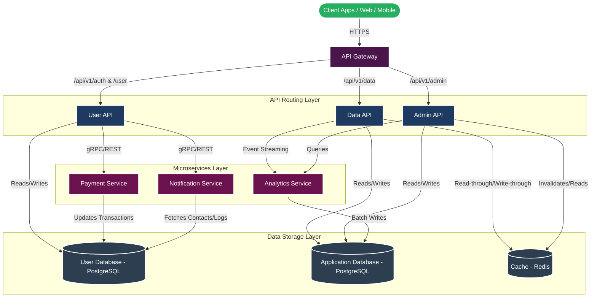

# System Architecture & Design Specification

This document provides a comprehensive blueprint of the system design, components, interfaces, database architecture, and infrastructure plan.

---

## 1. Architectural Diagram

The diagram below maps the client request lifecycle, routing via the API Gateway, internal service delegation, and data store distribution.

---

## 2. Design Decisions & Trade-Offs

### Monolith vs. Microservices
*   **Decision**: **Hybrid Microservices Model**. The APIs (User, Data, Admin) act as lightweight modular services (or microservices) communicating with backend worker microservices (**Payment**, **Notification**, **Analytics**).
*   **Trade-off**: Increases system complexity and network overhead but allows independent scaling of resource-intensive services (e.g., the analytics processing engine or notification queues can scale without affecting user authentication performance).

### SQL vs. NoSQL
*   **Decision**: Relational Databases (PostgreSQL) for both **User DB** and **Application DB**.
*   **Reasoning**: Financial transactions in the **Payment Service** and strict identity relationships require ACID compliance and foreign key safety.
*   **Cache Selection**: Redis is utilized as an in-memory key-value store to cache user sessions, API configurations, and hot records, resolving read bottlenecks on the SQL databases.

### Communication Pattern
*   **Synchronous**: **HTTPS/gRPC** for client-to-gateway and gateway-to-API requests where immediate feedback is necessary (e.g., login, payment authorization).
*   **Asynchronous**: **Message Queues (e.g., RabbitMQ or Kafka)** for dispatching notifications and reporting analytics events, preventing write-blocking on client requests.

---

## 3. Detailed Component Architecture

### A. API Gateway (Reverse Proxy & Security)
*   **Technology**: Kong, NGINX, or AWS API Gateway.
*   **Key Responsibilities**:
    *   **Rate Limiting**: Protects downstream APIs from DDoS attacks and API abuse.
    *   **JWT Validation**: Decodes client JSON Web Tokens to authorize routing permissions before reaching inner APIs.
    *   **CORS & SSL**: Standardizes Cross-Origin Resource Sharing policies and manages SSL certificate handshakes.

### B. Domain APIs (API Layer)
1.  **User API**
    *   *Domain*: User login, profile updates, credential management.
    *   *Integrations*: Invokes the `Payment Service` to upgrade accounts; invokes the `Notification Service` on signup.
2.  **Data API**
    *   *Domain*: Core operations dashboard data, business-specific queries.
    *   *Caching Strategy*: Implements **Cache-Aside pattern**. Checks Redis; on miss, fetches from App DB and populates cache.
3.  **Admin API**
    *   *Domain*: System configurations, user banning, financial auditing reports.
    *   *Access Control*: Restricts traffic through Role-Based Access Control (RBAC).

### C. Backend Worker Services (Microservices)
1.  **Payment Service**
    *   Decoupled worker responsible for connecting to third-party gateways (Stripe, PayPal).
    *   Guarantees idempotency on all charge requests using transaction references.
2.  **Notification Service**
    *   Queues messages (Email, SMS, Push notifications).
    *   Retries failed deliveries using exponential backoff policies.
3.  **Analytics Service**
    *   Ingests high-volume user activity logs.
    *   Aggregates event metrics asynchronously to minimize impact on system databases.

---

## 4. Database Schema Relationships

The relational database architecture is defined in the [DATABASE_SCHEMA.dbml](file:///c:/Users/cheveli%20sai%20kumar/Desktop/labour/.docs/DATABASE_SCHEMA.dbml) file.

### Key Entities
*   `users` & `user_profiles`: 1-to-1 relationship storing identity credentials and profile details.
*   `users` & `payments`: 1-to-Many relationship tracks historical account transactions.
*   `users` & `notifications`: 1-to-Many relationship tracks delivery status and message logs.
*   `users` & `analytics_logs`: Tracks user interactions, event types, and client device details.

---

## 5. Security & Reliability

*   **Data Encryption**: All data in transit uses TLS 1.3. Sensitive database columns (e.g., tokens, profile data) are encrypted at rest using AES-256.
*   **Secrets Management**: Environment variables and credentials are kept out of code repositories and injected via Secrets Managers (e.g., HashiCorp Vault, AWS Secrets Manager, Vercel Secrets).
*   **High Availability**:
    *   **Database Replication**: Databases use primary-replica architecture (Write to primary, read from read-replicas).
    *   **Disaster Recovery**: Automated nightly snapshots with database backups stored in multi-region secure storage.
