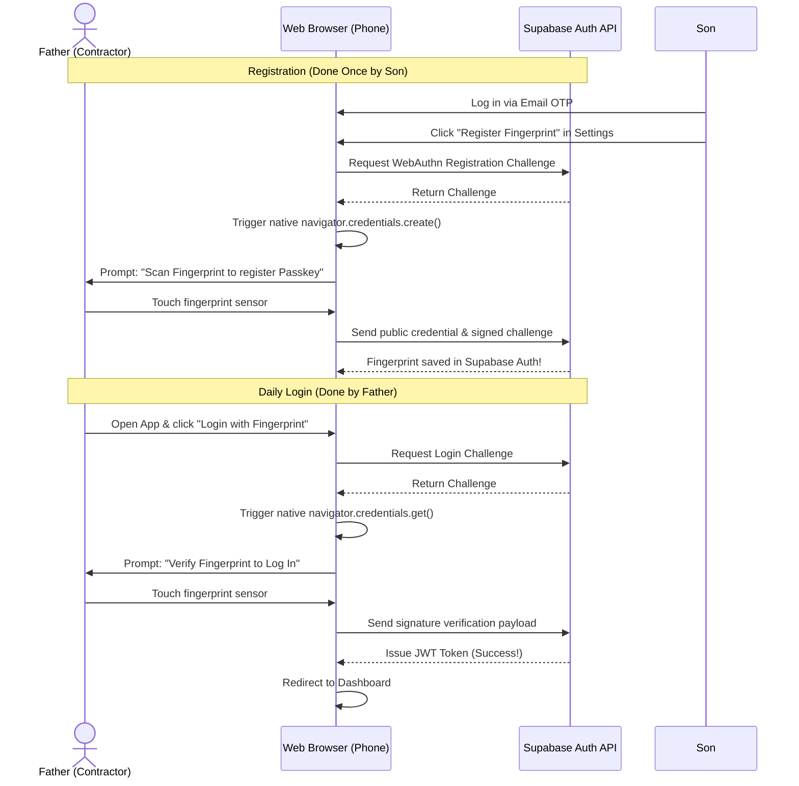

# Nirmana Biometric Authentication - Passkey/Fingerprint Login Proposal
*Architectural Guide to implementing passwordless & OTP-less Fingerprint login for user accessibility.*

To eliminate the need for entering email OTPs (which can be difficult for non-technical users like your father), you can implement **Biometric Authentication (Passkeys / WebAuthn)**. This allows a user to log in simply by scanning their fingerprint on their phone.

---

## 1. How WebAuthn (Passkeys) Works in the Browser

WebAuthn is a secure browser standard supported by iOS (Safari) and Android (Chrome). It uses the phone's built-in secure hardware (Enclave) to sign login challenges with a fingerprint/FaceID scan.



---

## 2. Supabase Integration Steps

Supabase Auth natively supports WebAuthn / Passkeys. Here is how the JavaScript implementation works:

### Step 1: Registering the Fingerprint (One-Time Setup)
When the user is logged in, you call the Supabase register function to prompt the browser for a fingerprint scan:

```typescript
import { createClient } from '@supabase/supabase-js'

const supabase = createClient(SUPABASE_URL, SUPABASE_ANON_KEY)

async function registerFingerprint() {
  try {
    // 1. Tell Supabase to start WebAuthn credential creation
    const { data, error } = await supabase.auth.admin.enrollMFA({
      factorType: 'webauthn', // Passkey/Fingerprint
      friendlyName: "Father's Phone Fingerprint"
    })

    if (error) throw error

    // 2. The browser automatically prompts the user to scan their finger
    // 3. Complete enrollment by sending the browser's credential back to Supabase
    const { error: verifyError } = await supabase.auth.admin.challengeMFA({
      factorId: data.id
    })

    if (verifyError) throw verifyError
    alert("Fingerprint registered successfully!")
  } catch (err) {
    console.error("Biometric registration failed:", err)
  }
}
```

### Step 2: Logging In with Fingerprint (Daily Use)
When your father opens the login page, you provide a large button **"Fingerprint Login"**:

```typescript
async function loginWithFingerprint() {
  try {
    // 1. Trigger Supabase Passkey Authentication
    const { data, error } = await supabase.auth.signInWithPasskey({
      // We can use the registered email to fetch the correct credential
      email: 'admin@example.com' 
    })

    if (error) throw error

    // 2. The phone prompts for the fingerprint.
    // 3. Once scanned, Supabase verifies the crypto signature and logs the user in.
    window.location.href = '/'
  } catch (err) {
    alert("Biometric verification failed. Please try again.")
  }
}
```

---

## 3. Advantages of Biometric Login for Accessibility

1. **Zero Text Typing:** No need to read a 6-digit number in an email inbox and copy-paste it.
2. **Instant Access:** Logging in takes less than **2 seconds** (tap button $\rightarrow$ touch sensor $\rightarrow$ redirect).
3. **No Password to Reset:** The biometric credential cannot be lost or forgotten because it is securely backed up in Google/Apple iCloud keychain accounts.
