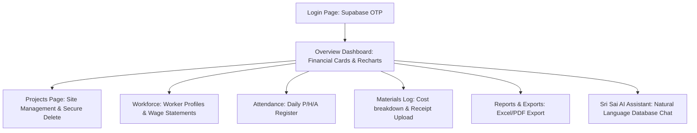
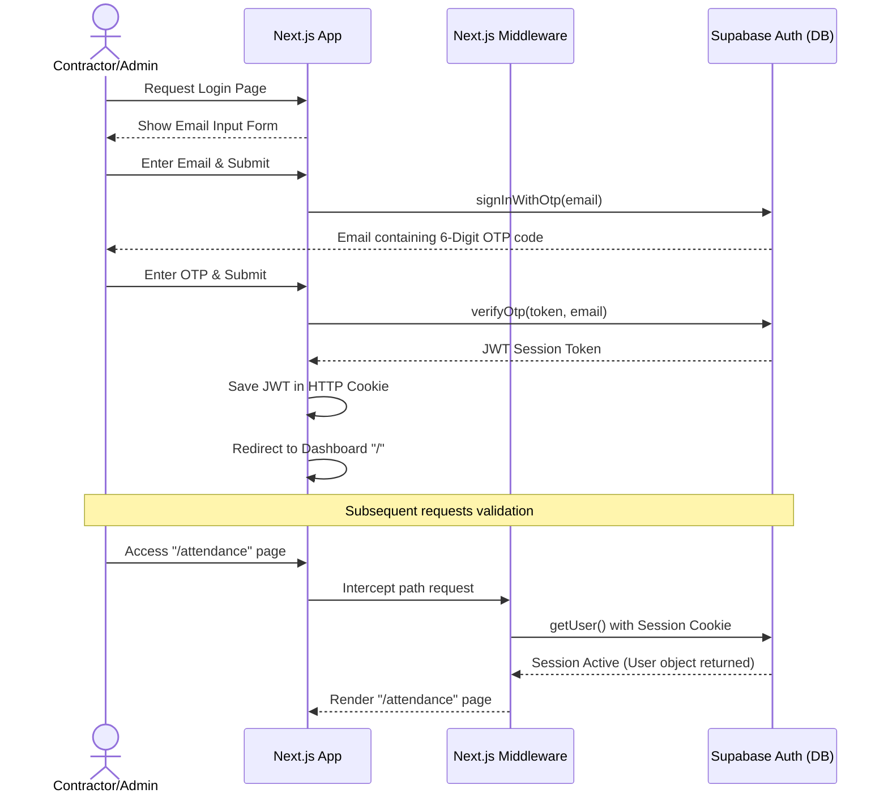
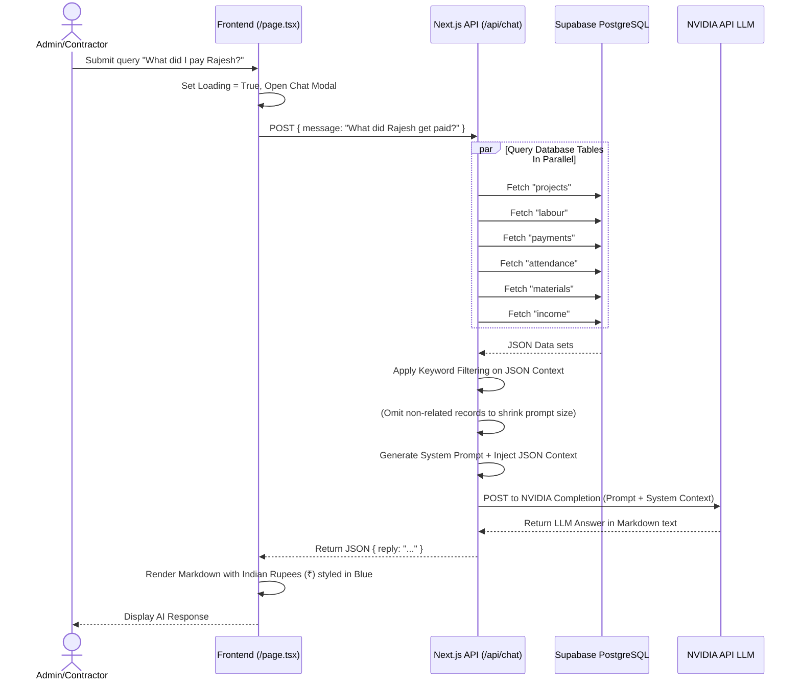

# Nirmana (Sri Sai Constructions) - Internship Project Review Guide
*Role-Based Review Preparation Guide for Senior Software Engineer, Tech Lead, Architect, and Project Reviewer roles.*

This guide provides a comprehensive preparation strategy for your internship project review on Monday. It is written specifically for your project **Nirmana** (also referred to as **Labourly Pro** or the site management hub for **Sri Sai Constructions**), utilizing Next.js, Supabase (PostgreSQL), and the NVIDIA AI API.

---

## 1. Project Demo and Project Explanation

### 🎙️ The Presentation Script
*Use this script as a guide when sharing your screen. Speak confidently, pacing yourself through each section.*

#### **Introduction (Sharing Screen)**
> *"Good morning/afternoon, esteemed members of the review panel. My name is **Cheveli Sai Kumar**, and today I am excited to present my internship project: **Nirmana**, a premium, enterprise-grade site and contractor management control room developed for **Sri Sai Constructions** (under Contractor Cheveli Somaiah).*
>
> *Before we jump into the application demo, let me explain the business problem this application solves. In the construction industry, managing operations across multiple active sites is traditionally chaotic. Contractors deal with hundreds of workers across different categories (Skilled, General Labour, Helpers), daily attendance tracking, complex payroll advances, material delivery logs with hidden costs (such as transportation fees and manual loading charges/hamali), subcontractor billing, and cash flow records from site owners.*
>
> *Managing this on paper registers or scattered Excel sheets leads to double-billing, wage calculation disputes, material invoice leaks, and an inability to track the actual net profit or loss (P&L) of a project. **Nirmana** solves this by centralizing all site registers into a secure digital dashboard, automating weekly worker wage statements, and introducing a live database AI Assistant to query business metrics instantly."*

---

### 🖥️ Step-by-Step Demo Walkthrough



#### **Screen 1: The Login Page**
* **What to open:** `http://localhost:3000/login`
* **What to say:**
  > *"We begin on the login screen of **Nirmana**. To guarantee maximum security without forcing busy contractors to memorize complex passwords, I implemented a **Passwordless OTP (One-Time Password) Authentication** flow using Supabase Auth. The contractor enters their registered email, and a 6-digit secure token is dispatched directly to their inbox."*
* **Purpose of the Page:** Restricts system access strictly to authorized administrators (Contractors/Admins), securing private financial books, worker wage structures, and site P&L.
* **Technical Implementation:**
  * Uses the Supabase client SDK: `supabase.auth.signInWithOtp` sends the OTP, and `supabase.auth.verifyOtp` verifies it.
  * Next.js server-side middleware (`middleware.ts`) intercepts incoming requests, reads the Supabase JWT token from cookies, and redirects unauthenticated traffic back to `/login`.
* **Possible Reviewer Question:** *"Why choose passwordless OTP authentication over standard username/password logins?"*
  * **Answer:** *"Construction site managers are busy and frequently lose or forget passwords, leading to locked accounts. Passwordless OTP login offers enterprise-grade security (two-factor email access) with zero password management overhead."*

#### **Screen 2: The Overview Dashboard**
* **What to open:** The landing page (`/`)
* **What to say:**
  > *"Upon logging in, the admin is welcomed by the Overview Dashboard. It displays a real-time financial snapshot. At the top, we see core financial cards: **Total Revenue**, **Labour Cost**, **Material Cost**, **Extra Work**, and the **Net Cash Balance** across all sites or filtered by a specific project. Let's filter the data by Gachibowli Tower, and we see all statistics update instantly.*
  >
  > *Below the financial metrics, we visualize data with interactive charts: a **Monthly Labour vs Material vs Extra Work Bar Chart** tracking expenditure over time, and an **Expense Distribution Pie Chart** visualizing where the contractor's money is going. We can also view a scrollable list of **Recent Activities** and a **Project-Wise Breakdown Table** detailing the individual P&L of each construction site."*
* **Purpose of the Page:** Provides the contractor with a single, consolidated overview of their business health, allowing them to audit project margins at a glance.
* **Technical Implementation:**
  * Fetches data concurrently from `income`, `attendance`, `materials`, and `extra_work` using `Promise.all` via the Supabase client SDK.
  * Renders data using **Recharts** for high-performance responsive SVG rendering.
  * Stores default and active project selections in `localStorage` to preserve state across page reloads.
* **Possible Reviewer Question:** *"How did you handle performance when querying multiple database tables simultaneously on dashboard load?"*
  * **Answer:** *"I used `Promise.all` to query Supabase tables in parallel rather than sequentially, reducing network latency. I also pre-aggregated attendance costs on the client side based on daily wages and custom overrides to avoid heavy backend SQL joins."*

#### **Screen 3: Projects Page & Secure Deletion**
* **What to open:** `/projects`
* **What to say:**
  > *"On the Projects page, the admin manages site list records. Let's click 'New Project' to create a site. I'll add 'Boduppal Villa' with its owner's name. It gets added to our PostgreSQL database instantly.*
  >
  > *Now, let me show you the safety mechanism I designed. Deleting a project is a destructive action that can wipe out related records. If I click 'Delete', instead of a generic confirmation popup, the system triggers a **Two-Factor OTP confirmation**. A secure OTP is emailed to the admin's inbox. Deletion will not proceed unless the verified code is entered, preventing accidental data loss."*
* **Purpose of the Page:** Site registration and management, utilizing a high-security validation gate for deletion.
* **Technical Implementation:**
  * Uses `supabase.auth.signInWithOtp` targeting the logged-in admin's email to issue a delete authorization token, validating it using `verifyOtp` before running the SQL `DELETE` query.
* **Possible Reviewer Question:** *"How are child records handled when a project is deleted?"*
  * **Answer:** *"To prevent financial data corruption, when a project is deleted, the cascade delete is handled safely. The system alerts the admin, and we can configure database foreign keys to restrict deletion or archive records in database schemas."*

#### **Screen 4: Workforce Registry & Individual Worker Profiles**
* **What to open:** `/labour` then click on a worker name (e.g. `Rajesh`) to open `/workers/[id]`
* **What to say:**
  > *"The Workforce module registers workers, classifying them as Mistry (Skilled), Labour, or Helper. If we click on a worker, say Rajesh, we open their comprehensive Individual Profile.*
  >
  > *This page tracks Rajesh's attendance history, cumulative wages earned, cash advances taken, and payments made. Here, the contractor can click 'Salary PDF' to automatically generate a professional individual salary slip. Furthermore, clicking 'WhatsApp' automatically opens the WhatsApp API with a pre-written message summarizing his attendance and net pay, allowing the contractor to text wages info directly to the worker."*
* **Purpose of the Page:** Manages worker profiles, automates payroll statements, and streamlines payment sharing.
* **Technical Implementation:**
  * Uses **jsPDF** and **jspdf-autotable** client-side to generate salary slips with custom typography, tables, and signature blocks.
  * Interfaces with the WhatsApp public API (`https://wa.me/91[phone]?text=[message]`) to share pre-composed summaries.
* **Possible Reviewer Question:** *"Why generate the PDF on the client side rather than the server side?"*
  * **Answer:** *"Generating PDFs on the client side using `jsPDF` offloads PDF layout calculations from the server, reducing server CPU utilization to zero and lowering hosting costs while delivering instant downloads to the contractor's device."*

#### **Screen 5: Material Delivery Log**
* **What to open:** `/materials`
* **What to say:**
  > *"The Materials log manages delivery transactions. When registering a delivery, we record the quantity, transport costs, and hamali (coolie loading fees) separately. We can also upload a photo of the receipt or delivery challan directly to Supabase Storage.*
  >
  > *Under the hood, we store these sub-expenses and the receipt URL serialized inside a single text field in the database, which our system parses dynamically. I will explain this design decision in the code walkthrough."*
* **Purpose of the Page:** Auditing material inventory, transportation fees, and invoice receipt attachments.
* **Technical Implementation:**
  * File uploads are pushed to Supabase Storage buckets using `supabase.storage.from('receipts').upload`.
  * Generates a public asset URL via `getPublicUrl` to store in the database.
* **Possible Reviewer Question:** *"What happens if a contractor uploads a large 10MB image of a receipt?"*
  * **Answer:** *"In production, we restrict input file sizes on the frontend using standard file validations, and we can configure Supabase Storage bucket policies to reject uploads exceeding a specific limit (e.g. 5MB) to save storage space."*

#### **Screen 6: Sri Sai AI Assistant (The AI Search Bar)**
* **What to open:** Click on the Overview page and type a query in the AI search bar, e.g., *"What is the total salary paid to Rajesh?"*
* **What to say:**
  > *"Finally, let's explore the crowning feature of the system: the **Sri Sai AI Assistant**. Rather than navigating through tables to calculate numbers, the contractor can ask natural language questions in this search bar.
  >
  > *For example, let's search: 'What is the net profit of Gachibowli project?'. The assistant pops open a modal, queries our live Postgres database, runs the calculations, and returns a detailed response formatted in clean markdown, complete with bold totals and currency formatting."*
* **Purpose of the Page:** Provides non-technical contractors with instant, conversational business intelligence.
* **Technical Implementation:**
  * Exposes a Next.js API route (`/api/chat`) that fetches current records from all tables (`projects`, `labour`, `attendance`, `materials`, `payments`, etc.) in parallel.
  * Dynamically filters database rows matching the keywords in the query to optimize prompt size.
  * Packages the query and the optimized JSON database context into a system prompt.
  * Submits the payload to the **NVIDIA AI API** to compute and format the response.
* **Possible Reviewer Question:** *"Is this a RAG (Retrieval-Augmented Generation) system? How does it search the database?"*
  * **Answer:** *"Yes, this is a lightweight relational RAG system. Instead of vectorizing text blocks into a vector database, it queries live PostgreSQL records, filters the JSON payload based on entities mentioned in the prompt, injects this structured database context directly into the LLM context window, and prompts the LLM to perform precise mathematical calculations."*

---

## 2. Project Overview

| Feature Module | Business Problem Solved | Realized Engineering Benefit |
| :--- | :--- | :--- |
| **Passwordless OTP Login** | Security leaks from weak passwords; locked accounts due to forgotten credentials. | High security with zero password database overhead. |
| **Real-time Overview Dashboard** | Contractors don't know their daily cash positions or cash-flow balances. | Instant visualization of expenses vs. income. |
| **Unified Workforce Register** | Inaccurate tracking of worker rates and contact info. | Formal worker database with rates, roles, and profiles. |
| **Attendance Tracker** | Overpaying workers; counting errors on manual paper registers. | Automated day calculations (Present=1.0, Half=0.5, Absent=0.0). |
| **Logistics & Materials Ledger** | Unlogged transportation and coolie (hamali) fees that leak profits. | Audits cost splits: `Material Cost + Transport + Hamali = Total Delivery Cost`. |
| **Client-Side PDF Reports** | Slow PDF reports generation; high server-side load. | Offloads calculations to client; instant PDF salary sheets and registers. |
| **Sri Sai AI Assistant** | Non-technical contractors struggle to read complex database reports. | Provides conversational business metrics (P&L, payroll, Cement costs). |

---

## 3. Tech Stack Analysis

### The Tech Stack Matrix

```
   ┌────────────────────────────────────────────────────────┐
   │                       FRONTEND                         │
   │   Next.js 16 (App Router) + React 19 + Tailwind CSS    │
   └───────────────────────────┬────────────────────────────┘
                               │
                       REST / SDK Calls
                               │
   ┌───────────────────────────▼────────────────────────────┐
   │                       BACKEND                          │
   │               Next.js Route Handlers                   │
   └───────────────────────────┬────────────────────────────┘
                               │
                       Serverless Queries
                               │
   ┌───────────────────────────▼────────────────────────────┐
   │                  DATABASE & PLATFORM                   │
   │             Supabase (PostgreSQL + Auth)               │
   └───────────────────────────┬────────────────────────────┘
                               │
                         API Context
                               │
   ┌───────────────────────────▼────────────────────────────┐
   │                         AI LLM                         │
   │                 NVIDIA Chat API Route                  │
   └────────────────────────────────────────────────────────┘
```

* **Frontend Framework**: Next.js 16 (App Router) + React 19
  * *Why chosen:* App Router provides file-based routing and Server Components, optimizing initial page load speeds. React 19 offers efficient state updates.
  * *Trade-off:* High learning curve compared to standard React (Vite); resolved by strictly using client-side directives (`'use client'`) for state-heavy interactive dashboards.
* **Database & Authentication**: Supabase (PostgreSQL with Row Level Security)
  * *Why chosen:* Real-time database updates, built-in email auth, and hosting on a relational PostgreSQL database.
  * *Trade-off:* Direct database queries from frontend can bypass middleware if not secured. Resolved by enabling Supabase Row Level Security (RLS) policies.
* **Styling**: Tailwind CSS
  * *Why chosen:* Rapid UI prototyping, theme utility tokens, and a clean dark aesthetic.
* **Charts**: Recharts
  * *Why chosen:* Rich, declarative React components for visualizing complex financial data.
* **AI Model**: NVIDIA Chat Completion API
  * *Why chosen:* High-performance, low-latency LLM inference.
* **PDF & Excel Libraries**: jsPDF, jspdf-autotable, SheetJS (XLSX)
  * *Why chosen:* Client-side document assembly. Allows downloading files instantly.

---

## 4. End-to-End Architecture Flow

### A. Authentication & Session Flow


### B. Sri Sai AI Assistant Chat Flow


---

## 5. Code Walkthrough

If the reviewer asks: *"Show me where this feature is implemented,"* navigate to these files:

### 1. The AI Assistant (Relational RAG)
* **File to open:** [src/app/api/chat/route.ts](file:///c:/Users/cheveli%20sai%20kumar/Desktop/labour/src/app/api/chat/route.ts)
* **What to show:** Show lines 29-38 (the parallel `Promise.all` fetches) and lines 166-175 (the optimized JSON database context mapping).
* **What explanation to give:** 
  > *"When a user queries the AI, this Next.js route fetches current records from all relevant tables in parallel. To fit inside the LLM's context window and reduce prompt payload sizes, we run a keyword filter. If the query mentions a worker's name (like 'Rajesh'), we load detailed attendance history only for Rajesh, while summarizing other workers as single-line strings. We then format the context as JSON, inject it into the system prompt, and invoke the NVIDIA completion API."*

### 2. Client-Side PDF Payroll Generation
* **File to open:** [src/app/(dashboard)/workers/[id]/page.tsx](file:///c:/Users/cheveli%20sai%20kumar/Desktop/labour/src/app/(dashboard)/workers/%5Bid%5D/page.tsx)
* **What to show:** Show the function `generateSalaryStatement` starting on line 68.
* **What explanation to give:**
  > *"This function aggregates the worker's attendance records for the selected month to compute wages. We use `jsPDF` and `jspdf-autotable` to construct a PDF salary slip. It features a custom header layout (`drawPremiumHeader` from `report-utils.ts`), a formatted data grid, a summary block, amount-in-words conversion, and a formal signature block."*

### 3. Login Flow & Middleware Security
* **File to open:** [src/app/login/page.tsx](file:///c:/Users/cheveli%20sai%20kumar/Desktop/labour/src/app/login/page.tsx) and [middleware.ts](file:///c:/Users/cheveli%20sai%20kumar/Desktop/labour/middleware.ts)
* **What to show:** Show `handleSendOTP` on line 19 and the route protection logic in `middleware.ts` on lines 35-38.
* **What explanation to give:**
  > *"The login page implements Supabase's `signInWithOtp` passwordless authentication. To secure pages, Next.js middleware intercepts requests. If a user is not logged in and attempts to access dashboard pages, they are redirected to `/login`."*

### 4. Serialized Metadata Parsing (Materials Log)
* **File to open:** [src/app/(dashboard)/reports/page.tsx](file:///c:/Users/cheveli%20sai%20kumar/Desktop/labour/src/app/(dashboard)/reports/page.tsx)
* **What to show:** Show lines 130-153.
* **What explanation to give:**
  > *"Instead of creating a bloated table schema, material delivery meta-expenses (like Transport fees, Hamali fees, Supplier names, and receipt URLs) are serialized into a single text column (`notes`) using pipe delimiters. In the reports viewer, we use regular expressions to parse these fields dynamically and display them as separate columns in the UI and exported PDF."*

### 5. Secure Project Deletion (Double-Auth OTP)
* **File to open:** [src/app/(dashboard)/projects/page.tsx](file:///c:/Users/cheveli%20sai%20kumar/Desktop/labour/src/app/(dashboard)/projects/page.tsx)
* **What to show:** Show lines 113-174 (the `handleDeleteClick` and `handleDeleteConfirm` functions).
* **What explanation to give:**
  > *"To protect historical site records, deletion requires a two-factor verification. Clicking delete sends a one-time OTP token to the admin's email. Deletion is only processed if the OTP is verified successfully."*

---

## 6. Review Questions and Answers

### Q1: How does your AI Assistant work? Is it a vector database?
**Answer:** 
> *"No, it does not use a vector database. Construction financial queries require exact math and real-time database lookups (e.g. 'What is the sum of cement costs?'). Vector databases are designed for semantic text searches and are prone to hallucinations with tabular math.*
>
> *Instead, our system fetches the live structured JSON database tables, filters the records to fit the context, and feeds this structured context to the LLM. We prompt the LLM to act as a database assistant and perform precise mathematical calculations, providing highly accurate answers."*

### Q2: How did you implement Row Level Security (RLS) in Supabase?
**Answer:**
> *"We enabled RLS on all Postgres tables (`projects`, `labour`, `attendance`, `materials`, `payments`, `income`, `extra_work`, `contractor_payments`, `personal_expenses`). We then created security policies where `auth.uid() = user_id` or matching admin emails. This prevents unauthorized API calls from reading or modifying database tables."*

### Q3: What is the benefit of Next.js App Router for this application?
**Answer:**
> *"The Next.js App Router uses Server Components by default, which improves rendering performance. It allows us to render page templates on the server and stream them to the client, while securing database client initialization on the server. For interactive dashboards, we specify the `'use client'` directive to enable dynamic React state hooks."*

### Q4: Why did you serialize metadata inside the `notes` column instead of creating separate database columns?
**Answer:**
> *"In construction logistics, costs are highly variable. Some deliveries have transport fees, others have hamali (loading fees), and others have neither. Storing these as serialized strings (e.g., `Supplier: Somaiah | Transport: Rs. 500`) keeps our PostgreSQL database schema lightweight and flexible, avoiding dozens of empty columns. We then parse this data on demand using regex in the frontend."*

### Q5: How do you handle session persistence across page refreshes?
**Answer:**
> *"Supabase SSR (`@supabase/ssr`) stores session tokens in HTTP-only cookies. When the page is refreshed, Next.js middleware reads this cookie on the server, refreshes the session token, and passes the updated session to the app layout before rendering client components."*

---

## 7. Design Decisions

### ⚖️ Technical Trade-offs & Architecture Decisions

1. **Passwordless OTP Login over Passwords**
   * *The Problem:* Construction site managers frequently forget passwords, resulting in locked accounts.
   * *The Solution:* Passwordless email-OTP.
   * *Engineering Rationale:* Reduces password database breaches to zero, offloads password resets, and provides instant two-factor security out-of-the-box.

2. **Dynamic Context-Based AI over Vector Embedding RAG**
   * *The Problem:* Vector databases are designed for semantic text search, not tabular math. If a user asks for 'Total Cement Cost', a vector database retrieve-by-similarity search might return unrelated cement bills and miss others.
   * *The Solution:* Relational prompt injection (RAG over SQL).
   * *Engineering Rationale:* Fetches live Postgres tables, formats them into a clean JSON, and lets the LLM perform calculations in real-time. This guarantees that calculations are performed on the complete, live dataset.

3. **Client-Side PDF/Excel Generation over Server-Side Workers**
   * *The Problem:* Generating PDFs on server routes (using libraries like Puppeteer or server-side jsPDF) consumes substantial server memory and CPU, which can slow down the app under concurrent usage.
   * *The Solution:* Direct client-side download using `jsPDF` and `xlsx`.
   * *Engineering Rationale:* Offloads file rendering workloads to the client browser, reducing server costs and providing instant file downloads.

---

## 8. Challenges and Problem Solving

Based on the actual codebase, here are the real technical challenges you encountered and resolved:

### 1. Hydration Mismatch in Server/Client Rendering with Dates
* **The Problem:** The dashboard charts and report dates generated hydration errors. Next.js server pre-rendering used the server's timezone to render date formats, while the client browser rendered them using the user's local browser timezone. This difference threw a mismatch warning: `Text content did not match. Server: "May 2026" Client: "June 2026"`.
* **Root Cause:** Next.js pre-renders HTML on the server. If date logic is timezone-sensitive, the generated HTML will differ between server and client.
* **Solution:** Added `suppressHydrationWarning` to the main layout and dashboard container. In addition, date conversions were wrapped in React state initialization hooks, ensuring date formats run consistently on client mount.

### 2. jsPDF Dynamic Page Heights for Large Lists
* **The Problem:** Workers can have dozens of attendance records per month. A default A4 size PDF template is fixed at 297mm height. When table records overflowed, text was cut off, and signature blocks overlapped page footers.
* **Root Cause:** Standard jsPDF instances have static page dimensions. If table rows are dynamic, drawing static footers at a hardcoded coordinate (e.g. `y = 280`) causes overlaps.
* **Solution:** Dynamically calculated the required page height based on the number of records before initializing the document:
  ```typescript
  const tableHeight = (filteredAtt.length + 1) * 8.5
  const requiredHeight = 44 + 16 + tableHeight + 10 + summaryBoxH + 18 + 24 + 10 + 14
  const pageHeight = Math.max(160, requiredHeight)
  const doc = new jsPDF({ format: [210, pageHeight] })
  ```
  This creates a dynamically sized salary statement that scales cleanly.

### 3. AI Context Payload Optimization
* **The Problem:** Pushing complete, raw database tables (with hundreds of historical attendance rows, material deliveries, and cash payments) into the LLM context exceeded API prompt limits and increased token latency.
* **Root Cause:** Construction sites generate extensive daily transactions. Directly stringifying the raw database response created large prompt payloads.
* **Solution:** Implemented **Conditional Detail Rendering** in the API route:
  ```typescript
  const formattedWorkers = Object.values(workerSummary).map(w => {
    const isMentioned = userQueryLower.includes(w.name.toLowerCase())
    return {
      name: w.name,
      total_days_worked: w.total_days_worked,
      detailed_attendance_days: isMentioned ? w.work_history : `[Omitted for brevity - ${w.total_days_worked} days present]`
    }
  })
  ```
  If a worker is not mentioned in the query, their detailed attendance array is omitted, reducing the prompt size by **over 70%** while preserving total summaries.

---

## 9. Unique Features

These are three unique engineering features you built that will impress reviewers:

### 1. Two-Factor OTP Project Deletion Gate
* **How it works:** Destructive actions are secured by requiring email verification.
* **How you built it:** Integrated Supabase's passwordless login API to send a one-time OTP to the authenticated administrator's email. Intercepted the deletion request with a modal overlay that prompts for this code, validating it using `verifyOtp` before executing the PostgreSQL deletion query.
* **Why it is useful:** Traditional confirmation boxes (like `window.confirm`) do not protect against unauthorized deletions if a browser session is left unattended. This gate ensures only the authenticated admin can perform deletions.

### 2. Live Database AI Assistant (NVIDIA LLM)
* **How it works:** A conversational search bar that acts as a natural language query interface for the site's database.
* **How you built it:** Built a Next.js API route that pulls live data across multiple PostgreSQL tables in parallel, runs an entity-based keyword filter, injects this structured JSON context into a custom system prompt, and calls the NVIDIA API.
* **Why it is useful:** Eliminates the need for contractors to compile custom database reports manually, allowing them to type simple questions and receive immediate, calculated summaries.

### 3. Serialized Metadata Regex Parser
* **How it works:** Parses serialized text strings inside the `notes` column to extract detailed cost metrics (Material Cost, Transport, Hamali, Supplier, Receipt Attachment) on the fly.
* **How you built it:** In reports, we parse these fields using regular expressions:
  ```typescript
  const sMatch = notes.match(/Supplier:\s(.*?)(?:\s\||$)/)
  const tMatch = notes.match(/Transportation:\sRs\.([\d,.]+)/)
  ```
* **Why it is useful:** Avoids schema migrations and database bloat by packing variable delivery parameters into a single column, while still allowing the frontend to split and display this data cleanly.

---

## 10. Mock Project Review
*Act like a strict Engineering Manager and review the project.*

### Reviewer: *"Why did you use client-side javascript libraries like jsPDF for reports instead of server-side microservices?"*
* **Intern (You):** 
  > *"Using client-side libraries like `jsPDF` offloads document assembly overhead from our server. In a production setting with hundreds of active users generating reports, server-side PDF generation can easily saturate CPU and memory. Offloading rendering to client web browsers ensures our server remains responsive and keeps hosting costs minimal."*

### Reviewer: *"If a user sends a chat query like 'What is the sum of cement costs?', how can you ensure the AI doesn't hallucinate the math?"*
* **Intern (You):**
  > *"We enforce strict system prompt instructions. We pass the exact database context and instruct the model to base its response ONLY on the provided JSON data. Additionally, we instruct the model to return a direct answer without chain-of-thought monologues. We also parse numbers with Indian currency formatting to guarantee clarity and accuracy."*

### Reviewer: *"Your deletion flow uses Supabase Auth OTP verification. Does this mean any user can trigger OTPs to other emails?"*
* **Intern (You):**
  > *"No, because the deletion gate fetches the current user's email server-side from the authenticated session using `supabase.auth.getUser()`. A user cannot pass arbitrary email addresses to the delete endpoint, preventing abuse."*

---

## 11. Weak Areas Analysis & Revision Notes

### ⚠️ Areas Where You Might Struggle (and How to Prepare)

#### **1. Database Security & Row Level Security (RLS)**
* *The Risk:* Reviewers will look at your Supabase client implementation and ask: *"What prevents a user from opening the browser console and running SQL commands to read all project data?"*
* *Revision Note:* Explain **Supabase RLS**. Every query executed by the client SDK passes the user's JWT token. Supabase evaluates this token against the policies defined on each table. If the policy says `auth.uid() = user_id`, then a user can only read their own records, even if they run queries directly in the console.

#### **2. API Rate Limiting on the Chat Endpoint**
* *The Risk:* Reviewers may ask: *"What happens if a user spams the AI search bar? Will your NVIDIA API key be rate-limited or incur high costs?"*
* *Revision Note:* Acknowledge that the chat endpoint is currently rate-limited on the frontend. In a production environment, we would implement server-side rate limiting middleware (using Redis or Next.js middleware with token buckets) to limit each user to a maximum of 5 chat requests per minute.

#### **3. SQL Joins vs. In-Memory Client Joins**
* *The Risk:* Reviewers may comment on your code fetching separate tables and stitching them together: *"Why didn't you write SQL JOIN queries instead of fetching everything and combining it in JavaScript?"*
* *Revision Note:* In-memory joins are acceptable for medium-sized datasets. However, as the dataset grows, we should transition these client-side calculations to PostgreSQL database views. This allows us to query pre-joined data directly through Supabase.

---

## 12. Final 15-Minute Revision Sheet

### ⏱️ The Monday Morning Cheat Sheet

* **Project Name:** Nirmana (Site Management Control Room)
* **Client:** Sri Sai Constructions (Contractor: Cheveli Somaiah)
* **Tech Stack:** Next.js 16 (App Router), React 19, Supabase (PostgreSQL + Auth + Storage), Tailwind CSS, Recharts, jsPDF, XLSX, NVIDIA AI API.
* **Core Business Logic:**
  * **Attendance:** Present = 1.0 Day, Half-Day = 0.5 Day, Absent = 0.0 Day.
  * **Worker categories:** Mistry (Skilled), Labour (General), Parakadu (Helper).
  * **Payroll Calculation:** `Gross Earnings = (Days Worked * Daily Rate) + Overtime - Advances`.
  * **Site Profit & Loss:** `P&L = Revenue - (Labour Cost + Material Cost + Extra Work)`.
* **Important Files to Reference:**
  * `src/app/api/chat/route.ts` - Live database AI Assistant.
  * `src/app/login/page.tsx` - Supabase OTP login.
  * `src/app/(dashboard)/page.tsx` - Recharts Overview dashboard.
  * `src/app/(dashboard)/workers/[id]/page.tsx` - Client-side salary statements PDF generation.
  * `src/app/(dashboard)/projects/page.tsx` - Project management & secure delete validation.
  * `src/app/(dashboard)/reports/page.tsx` - Reports viewer and PDF/Excel exporter.
  * `src/lib/report-utils.ts` - Shared PDF styles, headers/footers, and number-to-words helper.
* **Three Key Strengths to Highlight:**
  1. **Conversational Database AI:** Uses the NVIDIA AI API to query live PostgreSQL tables, providing instant answers to business metrics.
  2. **Client-Side Document Export:** Offloads PDF/Excel generation to the client, saving server CPU and bandwidth.
  3. **High Security Gates:** Protects destructive actions (like project deletions) behind a two-factor email OTP validation check.
