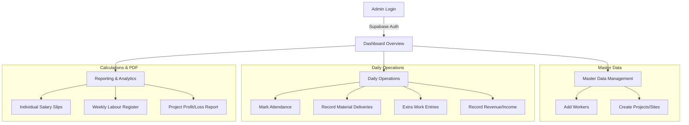
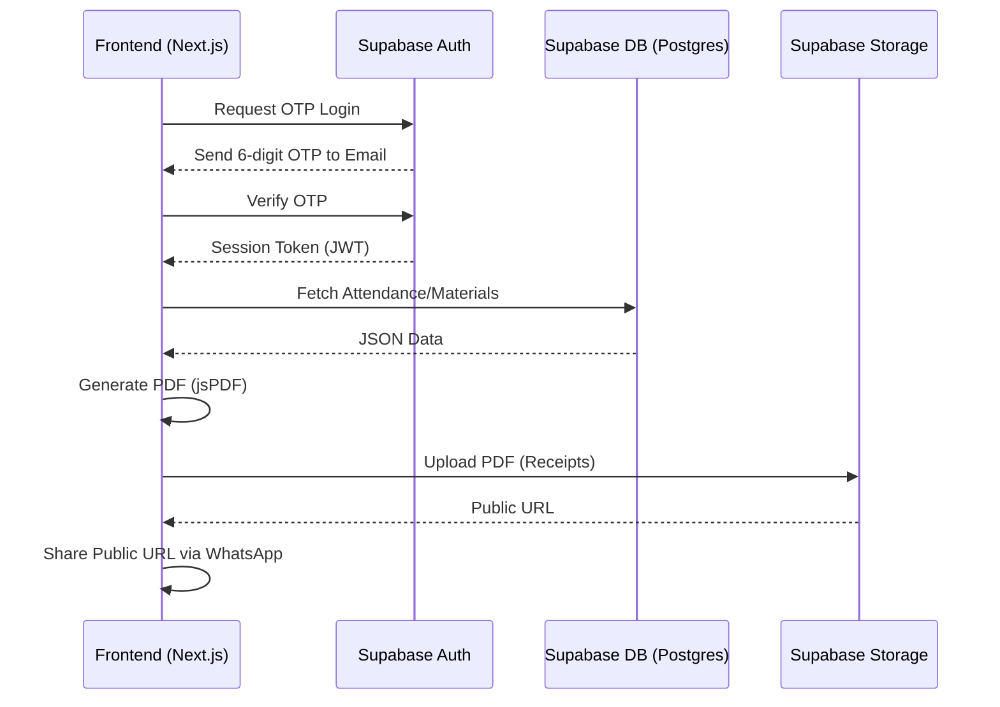

# Labourly Pro: Project Documentation & Architecture Guide

## 🏗️ The Heart of the Project
**Labourly Pro** is a premium, enterprise-grade contractor management platform designed to eliminate the chaos of site management. Its "love" lies in transforming messy, manual register entries into a sleek, automated control room. It empowers contractors to track every brick, every rupee, and every man-hour with absolute precision.

---

## 🛠️ Technology Stack

### Frontend (The Face)
- **Framework**: Next.js 15 (App Router)
- **Styling**: Tailwind CSS + Custom CSS for "Premium Dark Mode" aesthetics.
- **Components**: Lucide Icons, Radix UI (via Shadcn/UI), Framer Motion for animations.
- **Charts**: Recharts for real-time financial visualizations.

### Backend (The Brain)
- **Database & Auth**: Supabase (PostgreSQL with Row Level Security).
- **Client SDK**: Supabase JS Client for real-time data fetching.
- **Reporting**: jsPDF & AutoTable for dynamic PDF generation.

---

## 🔄 System Workflow (Flow Chart)

---

## 🧪 Detailed Process Logic

### 1. Attendance & Man-Days Logic
Attendance is tracked daily but summarized weekly.
- **P (Present)**: 1.0 Day
- **H (Half-Day)**: 0.5 Day
- **A (Absent)**: 0.0 Day

**Workforce Categorization (The M-L-P Formula):**
The system automatically categorizes workers to calculate "Man-Days":
- **M (Mistry/Skilled)**: Expert level workers.
- **L (Labour/Women)**: General workforce.
- **P (Parakadu/Helper)**: Supporting staff.

### 2. Financial Calculation Logic

#### **Worker Payroll (The Net Payable Formula):**
For any given period (usually a week):
`Total Earnings = (Days Worked × Daily Rate) + Overtime Amount`
`Net Payable = Total Earnings - Advance/Deduction`

#### **Project Profit & Loss (P&L):**
`Total Project Cost = Total Labour + Total Material + Total Extra Work`
`Net Profit = Total Project Revenue - Total Project Cost`

---

### 3. Frontend-Backend Interaction Flow

---

## 📈 Module Breakdown

| Module | Purpose | Key Calculation |
| :--- | :--- | :--- |
| **Attendance** | Daily head-count tracking | Computes total days per week |
| **Materials** | Inventory & delivery tracking | `Material + Transport + Hamali = Total` |
| **Payments** | Salary & Advance management | Tracks "Net Paid" to workers |
| **Income** | Tracking revenue from owners | Total cash inflow per project |
| **Export Calc** | Final weekly/monthly billing | Aggregates all expenses for P&L |

---

## 🛡️ Security
- **Auth**: Passwordless OTP login ensures only the admin can access the system.
- **Data Integrity**: Every transaction is linked to a `project_id` and `labour_id` to ensure accurate reporting.

---

*This guide was automatically generated to document the system architecture as of May 2026.*
