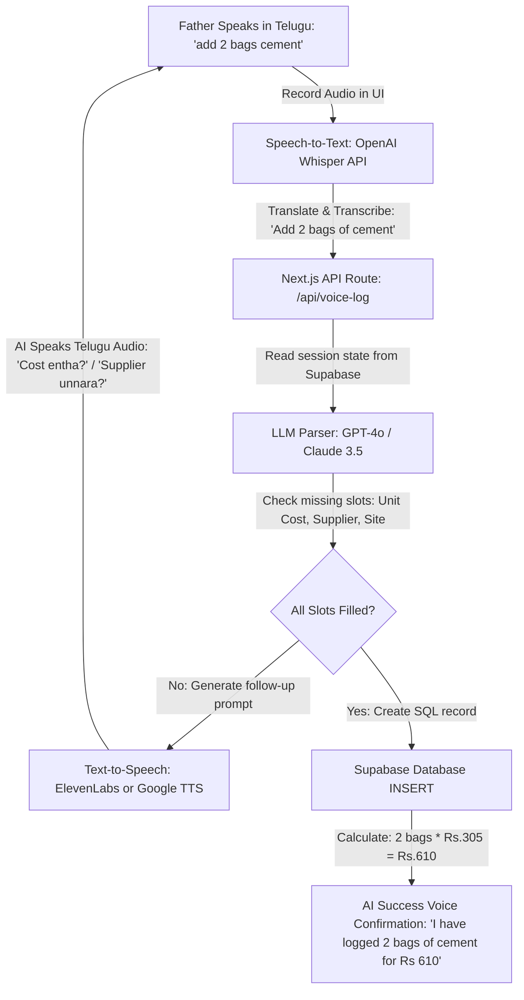

# Nirmana Voice Assistant - Telugu Conversational Slot-Filling Agent
*Architectural Proposal for Voice-Based Construction Logging (Telugu Speech to Automated Database Entry).*

To help an uneducated or busy contractor (such as your father) log site entries on the go, a **Voice-Driven Slot-Filling Chatbot** is highly feasible. It allows him to speak naturally in Telugu, transcribes the voice, collects missing details step-by-step (Slot-Filling), and logs the final values into Supabase.

---

## 1. High-Level Flow Chart



---

## 2. Technical Stack Recommendation

1. **Audio Capture (Frontend):**
   * HTML5 `MediaRecorder` API to capture mic input directly in the browser on a mobile screen.
2. **Speech-to-Text (STT) Translation:**
   * **OpenAI Whisper API:** Best-in-class at taking raw Telugu speech and translating/transcribing it directly to English text in one API call.
3. **Conversational Slot-Filling Engine:**
   * **Next.js API Route + LangChain/LangGraph:** Manages the dialog state.
   * **State Database Table (`voice_sessions`):** Keeps track of what variables are collected so far.
4. **Text-to-Speech (TTS) Playback:**
   * **Google Cloud Text-to-Speech** or **ElevenLabs:** Translates the AI's English text back to Telugu speech (audio files) to speak back to the user.

---

## 3. Database Schema for Session State (`voice_sessions`)
To handle multi-turn conversations (where the AI remembers what was said in the previous step), we keep a session state table:

| Column | Type | Description |
| :--- | :--- | :--- |
| **id** | `uuid` | Primary Key |
| **user_id** | `uuid` | Authenticated Contractor ID |
| **state** | `jsonb` | Extracted variables: `{ material_name: 'Cement', quantity: 2, unit_price: null, supplier: null }` |
| **last_question**| `text` | The question the AI just asked the user |
| **status** | `text` | `COLLECTING` or `COMPLETED` |

---

## 4. Next.js API Implementation Logic (Proof of Concept)

Below is the design for the server-side processor (`/api/voice-log/route.ts`) that handles each turn of the conversation:

```typescript
import { NextResponse } from 'next/server'
import { createClient } from '@supabase/supabase-js'

// LLM Schema defining the required slots for a Material entry
interface MaterialSlots {
  material_name: string | null;  // e.g. "Cement"
  quantity: number | null;       // e.g. 2
  unit: string | null;           // e.g. "bags"
  unit_price: number | null;     // e.g. 305
  supplier_name: string | null;  // e.g. "Somaiah"
  project_id: string | null;     // e.g. "Gachibowli Site"
}

export async function POST(req: Request) {
  try {
    const { userSpeechText, sessionId } = await req.json()
    const supabase = createClient(process.env.SUPABASE_URL!, process.env.SUPABASE_KEY!)

    // 1. Retrieve the existing session state from Supabase
    let { data: session } = await supabase
      .from('voice_sessions')
      .select('*')
      .eq('id', sessionId)
      .single()

    let currentSlots: MaterialSlots = session?.state || {
      material_name: null,
      quantity: null,
      unit: null,
      unit_price: null,
      supplier_name: null,
      project_id: null
    }

    // 2. Feed current slots + new user speech to LLM to extract new variables
    const llmResponse = await callLLMForExtraction(userSpeechText, currentSlots)
    currentSlots = llmResponse.updatedSlots

    // 3. Evaluate if we have all slots required to insert into 'materials' table
    if (
      currentSlots.material_name && 
      currentSlots.quantity && 
      currentSlots.unit_price
    ) {
      // All vital slots filled! Calculate totals and write to Supabase
      const totalAmount = currentSlots.quantity * currentSlots.unit_price
      const notes = `Supplier: ${currentSlots.supplier_name || 'Direct Purchase'} | Unit Price: Rs. ${currentSlots.unit_price}`

      await supabase.from('materials').insert([{
        name: currentSlots.material_name,
        quantity: currentSlots.quantity,
        unit: currentSlots.unit || 'units',
        total_amount: totalAmount,
        notes: notes,
        project_id: currentSlots.project_id || session.default_project_id
      }])

      // Clear the session state
      await supabase.from('voice_sessions').delete().eq('id', sessionId)

      // Return completion sound/response in Telugu
      return NextResponse.json({
        replyText: `నేను ${currentSlots.quantity} బ్యాగుల ${currentSlots.material_name} ను ₹${totalAmount} తో విజయవంతంగా యాడ్ చేసాను.`,
        isComplete: true
      })
    }

    // 4. If slots are missing, identify the next priority slot and ask for it
    let nextQuestion = ''
    if (!currentSlots.unit_price) {
      nextQuestion = 'ఒక బ్యాగ్ ధర ఎంత?' // "What is the cost of each bag?"
    } else if (!currentSlots.supplier_name && session.last_question !== 'supplier_checked') {
      nextQuestion = 'సప్లయర్ పేరు ఏమైనా ఉందా?' // "Do you have a supplier name?"
      // Tag session to mark that we checked supplier
      session.last_question = 'supplier_checked'
    }

    // Update the session state in Supabase
    await supabase
      .from('voice_sessions')
      .upsert({ id: sessionId, state: currentSlots, last_question: session?.last_question })

    return NextResponse.json({
      replyText: nextQuestion,
      isComplete: false
    })

  } catch (err: any) {
    return NextResponse.json({ error: err.message }, { status: 500 })
  }
}

// Simulated LLM Call (Using Structured Outputs / Tool Calling)
async function callLLMForExtraction(userInput: string, currentSlots: MaterialSlots) {
  // Uses GPT-4o function calling to parse:
  // "I bought it for 305 rupees" -> extracts: unit_price: 305
  return {
    updatedSlots: {
      ...currentSlots,
      // Extracted fields here
    }
  }
}
